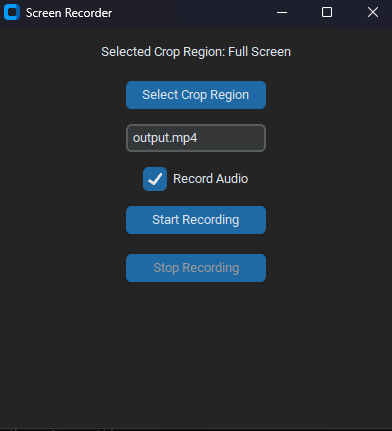

# 🎥 Screen Recorder


A simple and efficient screen recording application built with Python. Capture your screen activity with ease—perfect for tutorials, presentations, gameplay, and more!

---

## 🖼️ Preview

<p align="center">
  
  <br>
  <em>Main Interface</em>
</p>


## ✨ Features

- 📹 **Record Full Screen or Selected Area**
- 🔊 **Audio Recording Support** (Microphone & System Audio)
- 💾 **Save Recordings in Multiple Formats**
- ⏸️ **Pause & Resume Recordings**
- 🖥️ **Lightweight and User-Friendly Interface**
- 🛠️ **Customizable Settings**

---

## 🚀 Getting Started

### 1. Clone the Repository

```bash
git clone https://github.com/Lakshitpythondevloper/Screen-recorder.git
cd Screen-recorder
```

### 2. Install Requirements

Make sure you have Python 3.7+ installed.

```bash
pip install -r requirements.txt
```

> **Note:** You may need to install additional system dependencies for audio/video encoding (like `ffmpeg`).

### 3. Run the Application

```bash
python main.py
```

---

## 🛠️ Usage

- **Start Recording:** Click the "Start" button to begin capturing your screen.
- **Pause/Resume:** Use the "Pause" and "Resume" buttons as needed.
- **Stop & Save:** Click "Stop" to end the recording and save your file.

You can customize recording options in the settings menu.

---

## 📂 Output

All recordings will be saved in the `output/` directory by default. You can change this path in settings.

---

## 📦 Dependencies

Some of the main libraries used:

- [`pyautogui`](https://pypi.org/project/pyautogui/) - For screen capture
- [`opencv-python`](https://pypi.org/project/opencv-python/) - For video processing
- [`numpy`](https://pypi.org/project/numpy/) - For efficient array operations
- [`pyaudio`](https://pypi.org/project/PyAudio/) - For audio recording
- [`ffmpeg`](https://ffmpeg.org/) - For encoding (may require separate install)

Install all dependencies with:

```bash
pip install -r requirements.txt
```

---

## 📝 Code Explanation

Below is an overview of the main code files and what each does:

### `main.py`
- **Purpose:** Entry point of the application; launches the main user interface.
- **Explanation:** Handles initialization and connects UI events (like button clicks) to recording functions.

### `recorder.py`
- **Purpose:** Handles the logic for screen capturing and saving video files.
- **Explanation:** Uses libraries like `pyautogui` and `opencv` to grab screen frames, encode them, and write to video. Manages start, pause, resume, and stop actions.

### `audio.py` (if present)
- **Purpose:** Manages audio recording from microphone or system audio.
- **Explanation:** Uses `pyaudio` to capture audio streams and sync them with the video recording.

### `settings.py`
- **Purpose:** Stores and loads user preferences, like output folder, video format, or quality.
- **Explanation:** Reads/writes configuration files and applies settings throughout the app.

### `ui/` or `assets/` folder
- **Purpose:** Contains UI layout files, images, and icons.
- **Explanation:** Used by the main app to display buttons, windows, and other graphical elements.

> For more detailed explanations, please refer to comments within each code file.

---

## 🤝 Contributing

Contributions are welcome! Please open an issue or submit a pull request for any feature requests, bug fixes, or enhancements.

---

## 📄 License

This project is licensed under the [MIT License](LICENSE).

---

## 🙏 Acknowledgements

- Inspired by open-source screen recording tools.
- Thanks to the maintainers of the libraries used.

---

## 📫 Contact

For any queries or feedback, feel free to reach out:

- GitHub: [Lakshitpythondevloper](https://github.com/Lakshitpythondevloper)

---

> Enjoy recording your screen! 🚀
